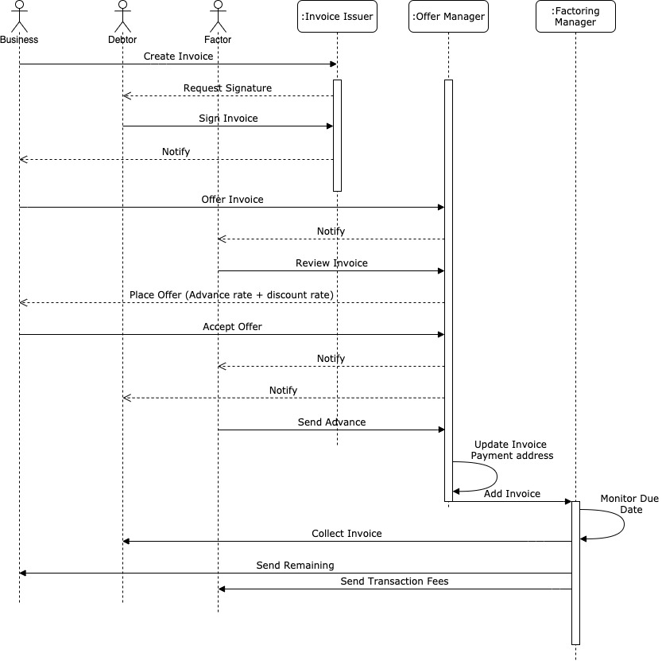
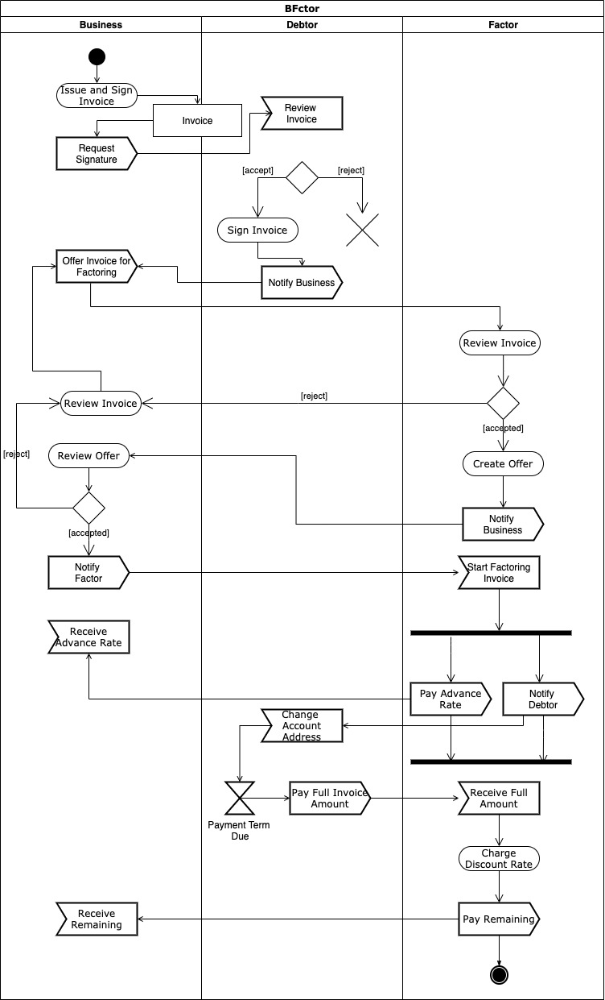
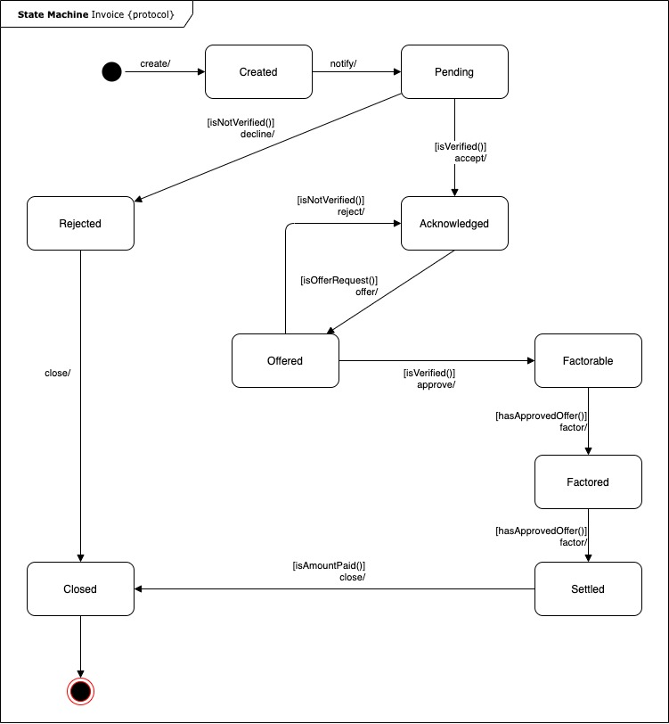

# BFactor
A Blockchain-Based Factoring Protocol.

## Factoring
### What is Factoring?
Factoring is a financial transaction and a type of debtor finance in which a business sells its accounts receivable (i.e., invoices) to a third party (called a factor) at a discount. A business will sometimes factor its receivable assets to meet its present and immediate cash needs. Factoring is commonly referred to as accounts receivable factoring, invoice factoring, and sometimes accounts receivable financing. Accounts receivable financing is a term more accurately used to describe a form of asset based lending against accounts receivable. The Commercial Finance Association is the leading trade association of the asset-based lending and factoring industries.

### Factoring Rationale
1. Companies can factor accounts when the available cash balance held by the firm is insufficient to meet current obligations and accommodate its other cash needs
2. Factoring allows the firm to maintain a smaller ongoing cash balance. By reducing the size of its cash balances, more money is made available for investment in the firm's growth
3. Factoring is also used as a financial instrument to provide better cash flow control especially if a company currently has a lot of accounts receivables with different credit terms to manage
4. A company will use factoring when it calculates that the rate of return on the proceeds invested in production exceed the costs associated with factoring the receivables

### Factoring Process
The factoring process can be broken up into two parts:

#### Application
Setting up a factoring account involves submitting the following:

- Application
- A list of clients
- Accounts receivable aging report
- A sample invoice

#### Application Review
The review process involves detailed underwriting, during which time the factoring company can ask for additional documents, such as documents of incorporation, financials, and banks statements. If approved, the business will be set up with a maximum credit line from which they can draw. 

#### Notification
In the case of notification factoring, the arrangement is not confidential and approval is contingent upon successful notification; a process by which factoring companies send the business's client or account debtor a Notice of Assignment. The Notice of Assignment serves to:

- inform debtors that a factoring company is managing all of the business's receivables,
- stake a claim on the financial rights for the receivables factored, and
- update the payment address

#### Ongoing funding
Once the account is set up, the business is ready to start funding invoices. Invoices are still approved on an individual basis as long as they meet the factor's criteria.

Receivables are funded in two parts: 
- The first part is the "advance" (usually covers 80% to 85% of the invoice value). This is paid immediately to the business
- The remaining (15% to 20%) is rebated, less the factoring fees, as soon as the invoice is paid in full to the factoring company

### Risks
Risks to a factor include:

- Counter-party credit risk related to clients and risk-covered debtors. Risk-covered debtors can be reinsured, which limit the risks of a factor. Trade receivables are a fairly low-risk asset due to their short duration.
- External fraud by clients: fake invoicing, misdirected payments, pre-invoicing, not assigned credit notes, etc. A fraud insurance policy and subjecting the client to audit could limit the risks.
- Legal, compliance and tax risks: large number of applicable laws and regulations in different countries
- Operational risks, such as contractual disputes
- Uniform Commercial Code (UCC-1) securing rights to assets.
- IRS liens associated with payroll taxes, etc.
- ICT risks: complicated, integrated factoring system, extensive data exchange with client

There are 3 different types of factoring namely:
1. Recourse Factoring
2. Non-Recourse Factoring
3. Reverse Factoring

Each of the factoring types has a different relationship between the Business, Factor, and Debtor and thus a different risk structure. The table below higlights the relationship between the entities involved and the inherent risk in each type:
| Factoring Type  | Relationships and Risk  |
|---|---|
| Recourse Factoring  | The factor advances the payment to the seller but the risk of the buyer failing to pay is born by the seller, who is accountable to the factor in the event of defaulting buyers. The operation may or may not notified to the buyer. The factor has a primary relationship with the seller. |
| Non-Recourse Factoring |The seller transfers the ownership of the credit to the factor in change for an advance payment. The factor becomes new creditor of the buyer and bears the risk for a defaulting buyer. The transfer is normally notified to buyers at the time in which their credits become due. The factor has a relationship with both seller and buyer. |
| Reverse Factoring | Based on the the line of credit attributable to each seller, the buyer prepares a payment service proposal for the seller in agreement with the factor. The buyer is directly responsible to pay the factor which has a primary relationship with the buyer. |$$

### Common Terms
#### Discount rate or factoring fee
The discount rate is the fee a factoring company charges to provide the factoring service. Since a formal factoring transaction involves the outright purchase of the invoice, the discount rate is typically stated as a percentage of the face value of the invoices. For instance, a factoring company may charge 5% for an invoice due in 45 days. In contrast, companies that do accounts receivable financing may charge per week or per month. Thus, an invoice financing company that charges 1% per week would result in a discount rate of 6–7% for the same invoice.
#### Advance rate
The advance rate is the percentage of an invoice that is paid out by the factoring company upfront. The difference between the face value of the invoice and the advance rates serves to protect factors against any losses and to ensure coverage for their fees. Once the invoice is paid, the factor gives the difference between the face value, advance amount and fees back to the business in the form of a factoring rebate.
#### Reserve account
Whereas the difference between the invoice face value and the advance serves as a reserve for a specific invoice, many factors also hold an ongoing reserve account which serves to further reduce the risk for the factoring company. This reserve account is typically 10–15% of the seller's credit line, but not all factoring companies hold reserve accounts.
#### Long-term contracts and minimums
While factoring fees and terms range widely, many factoring companies will have monthly minimums and require a long-term contract as a measure to guarantee a profitable relationship. Although shorter contract periods are now becoming more common, contracts and monthly minimums are typical with "whole ledger" factoring, which entails factoring all of a company's invoices or all of the company's invoices from a particular debtor.
#### Spot factoring
Spot factoring, or single invoice discounting, is an alternative to "whole ledger" and allows a company to factor a single invoice. The added flexibility for the business, and lack of predictable volume and monthly minimums for factoring providers means that spot factoring transactions usually carry a cost premium.

## BFactor Spot Factoring Protocol
The BFactor Protocol is an approach to using the public Ethereum *Mainnet* to enable factoring related transactions. The protocol is aimed at reducing capital expense and other overheads while increasing operational integrity when automating business processes across multiple companies.

The BFactor Protocol is an open source initiative that combines advances in cryptography, messaging, and blockchain to deliver secure and private factoring businesses processes at low cost. The protocol will enable confidential and complex transactions between ecosystem *Participant*s without leaving any sensitive data on-chain.

Factoring business process involves collaboration and data transfer among different parties and thus involves transfer or share of data among within the  *Participant*s internal systems of record. Failure to properly synchronize these systems between organizations causes considerable disruption and waste: disputes, lost inventory, inflated capital costs, regulatory actions, and other value leakage. To avoid these problems, systems require a common frame of reference. But only the largest high-volume partnerships can afford the capital expense involved in setting up such integrations. The BFactor approach employs the public Ethereum Mainnet as that common frame of reference, because it’s always on, companies can’t be locked out or restricted from using it, and they only need to pay for what they use.

However, past approaches to blockchain technology have had difficulty meeting the highest standards of privacy, security and performance required by corporate IT departments and the regulatory aspects required by lawmakers and market regulators. Overcoming these issues is the goal of the BFactor Protocol.

The protocol will support tokenization and decentralized of factoring services on the Mainnet in a way that doesn’t reveal corporate assets or activities to unauthorized parties, and it leaves enterprise data safely in traditional systems.

### BFactor Process

The BFactor Protocol identifies three ecosystem *Participants*:
1. Business
2. Debtor
3. Factor

The BFactor Protocol process can be divided into 3 main stages as follows:

#### Initialisation
The Business stores the invoice information into its local accounting system. The BFactor using authenticated access retrieves invoice information and creates a BFactor invoice and registered the hash of the invoice data on the chain. The BFactor requires the Business and the Debtor to sign the invoice.

#### Offering
Based on a signed invoice, the Business creates an invoice offer for factoring bids. Factors reviews and approves the invoice to determine the advance rate and discount rate they can offer. After approval of the invoice, the Factor creates an offer including *advance rate* and *discount rate*. The Business selects one of the offered bids and accepts it. 

#### Factoring
Once, accepted the Debtor is notified and the invoice payment address is changed from the Business acccount address to that of the Factor. The Factor transfers the advance rate to the Business account address. The BFactor Protocol maintains the invoices due date and ensures the full amount is transferred to the Factors account address on the set date. Upon receiving the full invoice amount from the Debtor, the Factor transfers the remaining invoice amount to the Business less the discount rate/factoring fees.

A high-level sequence diagram that highlights how BFactor interacts with the different entities to provide the factoring functionality is shown below:

The following activity diagram higlights the sequence of processes within BFactor:

The invoice is the main focus of BFactor that transitions between different states throughout the BFactor process lifecycle. The following state diagram shows the different stable states for the invoice and explains how the invoice could change its state over the time:

### BFactor Spot Non-Recource Factoring Platform

The BFactor Platform is built on the BFactor Protocol. The platform creats a complete economic mechanism involving all involved parties. The mechanism creates a set of rewards and penalties to esnure the system liveness and security. 

The BFactor Platform enables the Business to make better decisions regarding factoring their receivables. The Business must balance the cost of obtaining cash proceeds from a factor against the opportunity cost of losing the Rate of Return it earns on investment within its business. BFactor Platform through open bidding mechanism allows the business to go for the either the suitable advance rate or discount rate depending on the business need at any point in time.

On the Factor's side, the platform allows for reliable Debtor credit rating (not only through credit score) based on the Debtor's commitment to its financial obligations on the network. In addition, analytics regarding the expected factoring and cashflow needs for the Business allows the Factor to make enlightened decision regarding the offered advance and discount rates without the need for long-term contracts and minimums. The Platform also protects the Factors aganist double pledging (i.e. impossibility of factors to check whether an invoice has been already factored).

The use of cryptocurrency is required for the settellment of all financial committments on the platform. The cryptocurrencies are characterised by their high volatility and thus cannot be used as a unit of account or a store of value (as in BFactor Platform case). Hence, the use of stablecoins is implemented to minimize the effects of volatility. the stablecoin for BFactor Platform is chosen to be pegged to other cryptocurrencies and thus maintain its decentralisation chatacteristics. A cryptocurrency-backed stablecoins is to be issued with cryptocurrencies as collateral, which is conceptually similar to fiat-backed stablecoins. While fiat collateralization typically happens off the blockchain, the cryptocurrency or crypto asset used to back BFactor Platform stablecoins is done on the blockchain, using smart contracts in a more decentralized fashion. When the Factor opens a collateralized debt position (CDP), ETH are deposited as collateral, and then stablecoin is withdrawn from their CDP. The ETH acts as collateral.

### Refrences
[1] Battaiola, E., Massacci2, F., Nam Ngo, C., &amp; Sterlini, P. (2018). Blockchain-based Invoice Factoring: from business ... [http://ceur-ws.org/Vol-2334/DLTpaper2.pdf](http://ceur-ws.org/Vol-2334/DLTpaper2.pdf).

[2] Wood, Gavin. “Ethereum: A Secure Decentralised Generalised Transaction Ledger.” Ethereum, Ethereum, 8 June 2020, [ethereum.github.io/yellowpaper/paper.pdf](https://ethereum.github.io/yellowpaper/paper.pdf).